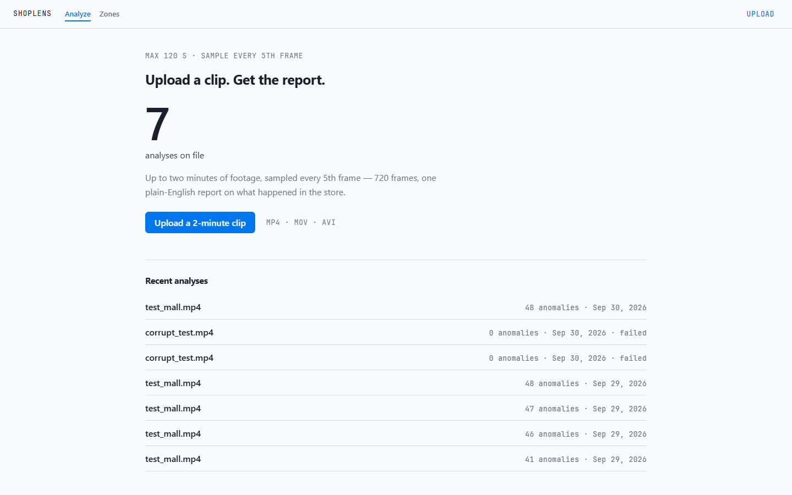
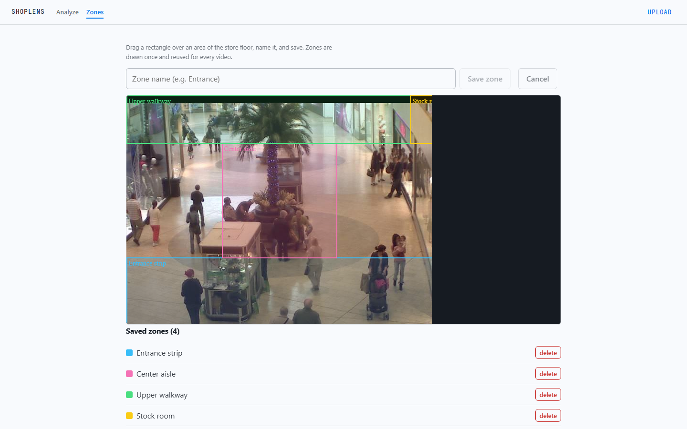
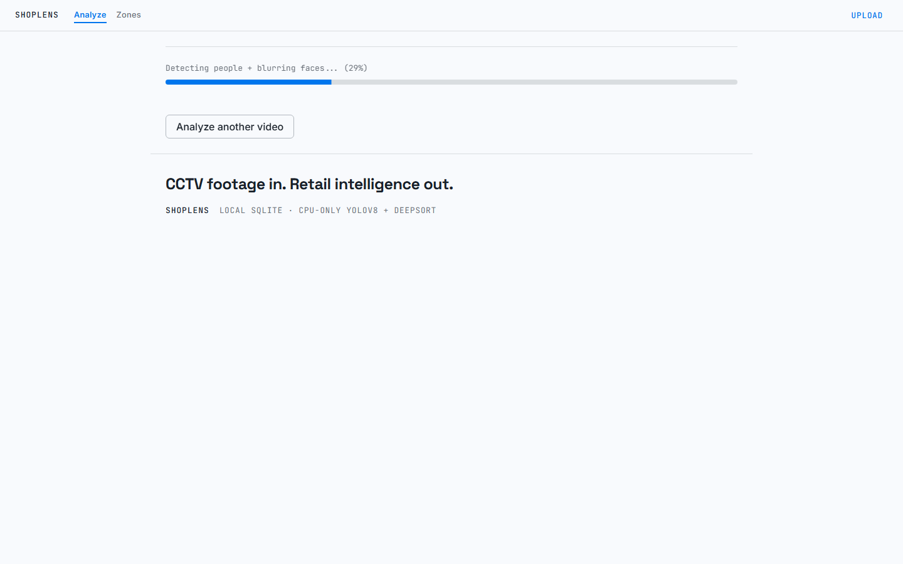
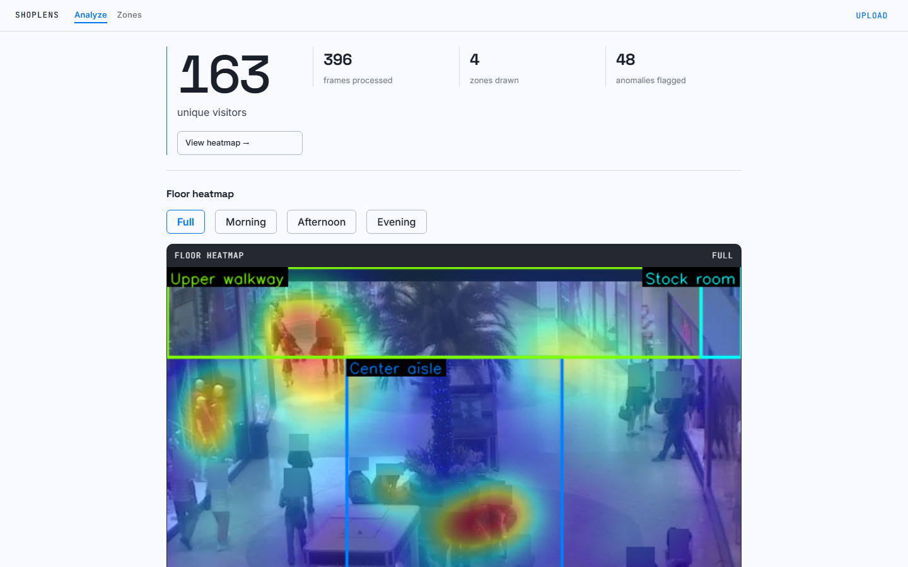
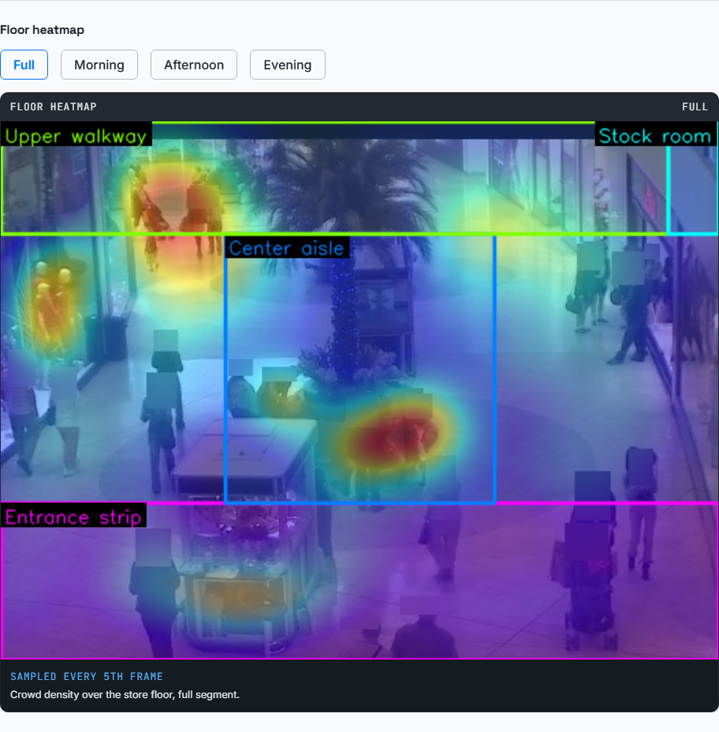
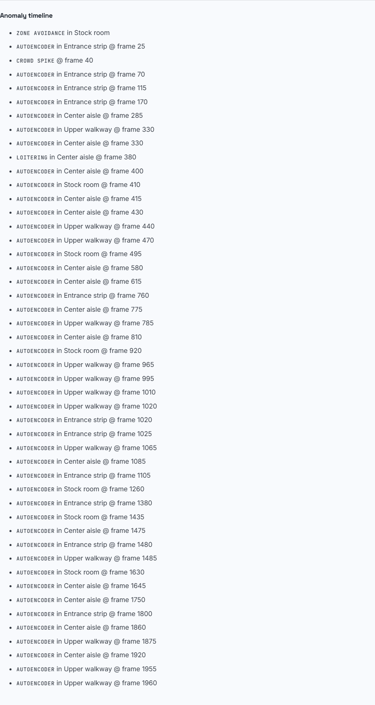
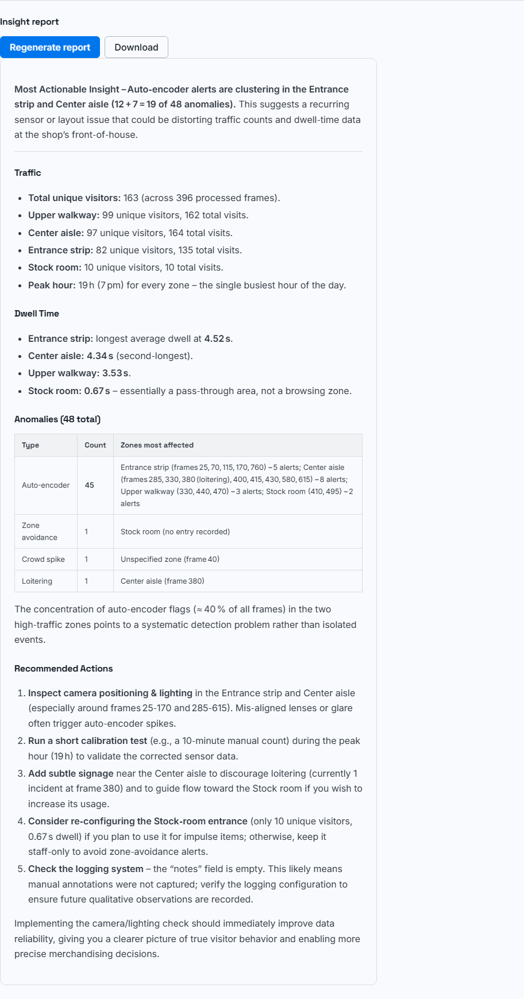

# ShopLens

Turn existing CCTV footage into retail intelligence for small shops — person detection, multi-person tracking, zone analytics, floor heatmaps, anomaly detection, and an auto-generated plain-English insight report. No GPU, no expensive hardware: upload a 2-minute clip, get answers a shop owner can act on.

## 1. Project Overview

Small shops already have cameras but no insight — nobody knows which zones customers ignore, when rush hour actually is, or whether a layout change worked. Professional retail-analytics systems cost far more than a small shop will ever spend.

ShopLens closes that gap on a laptop: it reads an uploaded clip, detects and tracks every person, measures each zone the owner drew, flags unusual behaviour, and has an LLM write down what to do about it — in plain English, not charts.

Everything is measured, not asserted: detection MAE, tracking ID stability, and anomaly precision/recall are all evaluated on the public Mall Dataset (results in [§11](#11-testing)).

Constraints that shaped every decision:

- **CPU only** — no GPU was available at any point (free-tier hosting)
- **Upload-based**, not real-time streaming (MVP)
- **Max 2-minute clips**, sampled every 5th frame (full-frame CPU processing would take hours)
- **Privacy first** — faces blurred immediately after detection; no unblurred processed frame is ever written to disk
- **Non-technical user** — output must be plain English

## 2. Features

- **Upload → background job with live progress** — 7-step pipeline, dashboard polls status every 3 s and shows "Step 3/7: Tracking IDs with DeepSORT… (43%)"
- **Zone drawing canvas** (Fabric.js) — draw zones once for your store layout; every future video reuses them
- **Per-zone analytics** — unique visitors, total visits, average dwell time, peak hour, per zone
- **Floor heatmap** — Gaussian crowd-density overlay on the store frame, split into full / morning / afternoon / evening segments
- **Anomaly detection** — unsupervised autoencoder scores every zone visit, plus three typed rules: loitering (≥ 30 s standing), crowd spike (> 2× rolling baseline), zone avoidance (a zone nobody enters)
- **LLM insight report** — Groq model reads the real analytics + anomaly rows and writes actionable suggestions; regenerate on demand, download as styled HTML
- **Failure handling** — corrupt or over-long videos fail in under a second with a readable message in the UI; a report-generation failure never fails the whole job
- **Privacy** — Gaussian face blur runs right after detection, before any frame is persisted; DeepSORT IDs are per-clip counting aids, never linked to identity

## 3. Tech Stack

| layer | technology | role / why this one |
|---|---|---|
| Frontend | React 18 + TypeScript + Vite | dashboard, canvas, and polling UI; `tsc && vite build` for type-checked builds |
| Canvas & charts | Fabric.js, Recharts | zone polygons need a real interactive canvas (Streamlit can't do this) |
| Backend | FastAPI + uvicorn | async I/O around CPU-bound work; automatic OpenAPI docs at `/docs` |
| Job queue | in-process `threading.Thread` (`app/jobs.py`) | zero-infrastructure local MVP; swapping to a managed queue later is a `jobs.py` change |
| Database | SQLite (`data/shoplens.db`) | relational: zones → analytics → anomalies → reports |
| File storage | local disk (`storage/`) | uploads + heatmap PNGs |
| Detection | YOLOv8n (`ultralytics`, PyTorch) | fastest CPU-friendly YOLOv8 variant — the whole CV stack is PyTorch, one framework |
| Tracking | DeepSORT (`deep_sort_realtime`) + MobileNetV2 re-ID embedder (library default), embedder on CPU | appearance embedding keeps IDs stable when people cross paths |
| Anomaly ML | PyTorch autoencoder (`4→8→4→2→4→8→4` MLP) + rule classifiers | unsupervised — no labelled anomaly data needed; rules give each flag a human-readable type |
| LLM | Groq API, `openai/gpt-oss-120b` (OpenAI-compatible, configurable) | free tier, fast, no GPU — Ollama was rejected because the deployment target can't host it |
| Experiment tracking | MLflow (local `mlruns/`) | one-line proof of real training runs for the mentor (`mlflow ui`) |
| Eval/training utils | scikit-learn (scaler), pandas-style CSV metrics | reproducible MAE / precision-recall scripts |

## 4. Architecture

```
User uploads video (max 2 min, ≤ 200 MB)
       ↓
React frontend ──────────── FastAPI (:8000, Vite proxies /api)
                                ↓
                    background thread (one per upload)
                    OpenCV reads frames (every 5th)
                    YOLOv8n detects people → faces blurred
                    DeepSORT assigns track IDs
                    Zone analytics (visitors / dwell / peak hour)
                    Gaussian heatmap (full + 3 time segments)
                    Autoencoder scores visits → anomaly flags
                    Groq LLM writes the insight report
                                ↓
                    data/shoplens.db (SQLite)  +  storage/ (local disk)
                                ↓
React dashboard polls GET /status/{job_id} every 3 s
  → stats, zone table, heatmap, anomaly timeline, report
```

One upload = one job = one thread that runs the whole pipeline in order. Every step logs its own duration, and progress ("Step N/7") is written to SQLite so the UI can poll it. Zones come **from the database**, not from the video — they're drawn once and reused forever.

> **Runs locally by design:** one `uvicorn` process + SQLite + local disk — zero infrastructure, which is what a laptop demo needs. Cloud hosting was optional for the submission and was not attempted.

## 5. Project Structure

```
shoplens/
├── .env.example              copy to .env; every variable is optional (see §6)
├── backend/
│   ├── app/
│   │   ├── main.py           FastAPI app + router registration
│   │   ├── config.py         repo-relative paths + env settings
│   │   ├── db.py             SQLite schema and queries
│   │   ├── jobs.py           background-thread queue + resume on restart
│   │   ├── storage.py        uploaded-video + artifact storage
│   │   ├── routes/           upload, status, jobs, analytics, heatmap, report, zones
│   │   └── services/         Groq report generation (prompt template lives here)
│   ├── cv/                   detector (YOLOv8), tracker (DeepSORT), zones, heatmap,
│   │                         anomaly (autoencoder + rules), blur
│   ├── workers/pipeline.py   the one job: read → detect → track → zones → heatmap
│   │                         → anomalies → report (per-step timing logged)
│   ├── training/             train_autoencoder.py (MLflow-tracked), register_model.py
│   ├── evaluation/metrics.py MAE/RMSE, precision/recall, threshold tables
│   ├── scripts/              reproducible evidence generators (score_labels,
│   │                         report_prompt_sweep, plot_anomaly_trajectories, ...)
│   ├── models/               autoencoder.pth, threshold.json, zone_index.json
│   └── requirements.txt
├── frontend/                 React + Vite + TypeScript
│   └── src/components/       ZoneCanvas, Dashboard, Heatmap, ProgressBar, Report
├── notebooks/                Colab: 01_detection, 02_tracking, 03_autoencoder
├── data/                     mall frames, labels, generated caches, SQLite DB (git-ignored)
├── storage/                  uploaded videos + per-job heatmaps (git-ignored)
└── docs/                     evidence/ (CSV, plots, annotated video), screenshots/
```

## 6. Installation & Setup

**Prerequisites:** Python 3.11+, Node 18+. No Docker, Redis, or GPU required.

```bash
# 1. Backend
python -m venv .venv
.venv\Scripts\activate          # macOS/Linux: source .venv/bin/activate
pip install -r backend/requirements.txt

cd backend
uvicorn app.main:app --reload   # → http://localhost:8000/health
```

```bash
# 2. Frontend (separate terminal)
cd frontend
npm install
npm run dev                     # → http://localhost:5173
```

### Environment variables

Copy `.env.example` → `.env` at the repo root. **Every variable is optional** — the app runs fully without one:

| variable | default | what it affects |
|---|---|---|
| `GROQ_API_KEY` | — (no key) | without it, only the LLM report step is skipped; detection → anomalies all still run |
| `LLM_API_URL` | `https://api.groq.com/openai/v1/chat/completions` | any OpenAI-compatible endpoint |
| `LLM_MODEL` | `openai/gpt-oss-120b` | swap the model without code changes |
| `FRONTEND_ORIGIN` | `http://localhost:5173` | CORS origin for the dev server |
| `DATABASE_PATH` | `<repo>/data/shoplens.db` | SQLite location |
| `STORAGE_DIR` | `<repo>/storage` | uploaded videos + heatmaps |
| `DATA_DIR` | `<repo>/data` | datasets, labels, caches |
| `MODELS_DIR` | `<repo>/backend/models` | trained autoencoder + threshold |
| `VITE_API_URL` *(in `frontend/.env`)* | `/api` | Vite proxy target (rewrites `/api/*` → `:8000`) |

Get a free Groq key at <https://console.groq.com> — the report step is the only thing that needs it.

## 7. Usage

1. Open **http://localhost:5173**.
2. **Zones tab (once per store):** click on the canvas to place polygon points around Entrance / Aisles / Counter, name each zone, save. Zones persist in the database and are reused by every future video.
3. **Upload tab:** drop a clip (`.mp4/.mov/.avi/.mkv`, ≤ 200 MB, ≤ 2 minutes). You immediately get a `job_id`.
4. **Watch the progress bar** step through: read frames → detect + blur → track → zones → heatmap → anomalies → report (polled every 3 s).
5. **Dashboard:** visitor stats, per-zone traffic chart, floor heatmap with time-segment tabs, anomaly timeline (type + frame + zone), and the insight report.
6. **Report:** *Regenerate* reruns just the LLM step; *Download* saves it as a styled HTML file you can send to the owner.

Zones drawn for a different store layout? Delete/re-draw them in the Zones tab — analytics always use the zones as they exist when the job runs.

## 8. Screenshots / Demo

No live demo link — the app runs locally by design. The screenshots below are the demo:

**1. Upload** — drag in a clip under 2 minutes:



**2. Zones** — drawn once with the canvas, reused for every later video:



**3. Progress** — live step updates while the job runs:



**4. Dashboard** — visitor stats for the whole video:



**5. Heatmap** — crowd density per floor segment (full / morning / afternoon / evening):



**6. Anomalies** — every flagged event with its frame and zone:



**7. Report** — the auto-generated plain-English insight report:



## 9. API Documentation

**Base URL:** `http://localhost:8000` (the frontend dev server proxies `/api/*` → `:8000`).
**Auth:** none — this is a local MVP; there is no user system.
Interactive docs: `http://localhost:8000/docs` (Swagger UI, generated by FastAPI).

### Endpoints

| method | endpoint | purpose |
|---|---|---|
| `POST` | `/upload` | upload a video, queue a processing job |
| `GET` | `/status/{job_id}` | live progress — polled by the dashboard every 3 s |
| `GET` | `/jobs?limit=20` | list recent jobs |
| `GET` | `/analytics/{job_id}` | stats + zone summary + anomaly list |
| `GET` | `/heatmap/{job_id}` | heatmap PNG with zone overlays |
| `GET` | `/report/{job_id}` | the generated insight report |
| `POST` | `/reports/generate` | regenerate the report for a finished job |
| `GET` | `/zones` | list saved zones |
| `POST` | `/zones` | create a zone |
| `DELETE` | `/zones/{zone_id}` | delete a zone |
| `GET` | `/zones/frame` | reference frame served to the drawing canvas |

### Request / response details

**`POST /upload`** — `multipart/form-data`, field `file`.

```bash
curl -F "file=@clip.mp4" http://localhost:8000/upload
# → {"job_id": "3b42d240-…", "status": "queued", "video": {…}}
```

Errors: `400` unsupported type (`.mp4/.mov/.avi/.mkv` only), `413` larger than 200 MB.
A clip longer than 120 s passes upload but the job fails fast with
`"Video longer than 120 seconds"`.

**`GET /status/{job_id}`**

```json
{
  "job_id": "3b42d240-…",
  "state": "processing",
  "step": 3,
  "total_steps": 7,
  "message": "Tracking IDs with DeepSORT... (43%)",
  "updated_at": "2026-09-30T14:48:23+00:00"
}
```

`state`: `queued → processing → complete | failed`. Terminal states are final; the UI
shows `Processing failed: <message>` for `failed`. `404` for unknown `job_id`.

**`GET /analytics/{job_id}`** → `200` JSON:

```json
{
  "video_id": "3b42d240-…",
  "frames_processed": 396,
  "unique_visitors": 163,
  "zone_summary": {
    "…zone-id…": { "unique_visitors": 99, "total_visits": 162, "avg_dwell_seconds": 3.53, "peak_hour": 20 }
  },
  "zone_names": { "…zone-id…": "Upper walkway" },
  "heatmap_keys": ["heatmaps/…/full.png", "…/morning.png", "…/afternoon.png", "…/evening.png"],
  "anomalies": [
    {
      "id": 230,
      "anomaly_type": "zone_avoidance",
      "zone_id": "…zone-id…",
      "frame": null,
      "details": { "zone_visitors": 10, "typical_zone_visitors": 89 },
      "created_at": "2026-09-30T14:54:20Z"
    }
  ]
}
```

`anomaly_type` is one of `autoencoder`, `loitering`, `crowd_spike`, `zone_avoidance`;
`frame` is the sampled frame number where applicable (`null` for whole-clip findings).
`404` while the job hasn't reached the analytics step.

**`GET /heatmap/{job_id}?time_range=full|morning|afternoon|evening`** → `image/png`
(zones + labels drawn on top). `400` invalid segment, `404` not generated yet.

**`GET /report/{job_id}`** → `200` JSON:
`{ "id": 7, "video_id": "…", "content": "**Most Actionable Insight…** (markdown)",
"model": "openai/gpt-oss-120b", "created_at": "…" }`. `404` if no report exists yet
(no API key, or the job is still running).

**`POST /reports/generate`** — body `{ "video_id": "<job_id>" }`.
Regenerates from the stored analytics. `409` while the job is still running, `404`
unknown job. A failed LLM call returns an error for this request only — the original
job stays `complete`.

**Zones**

- `GET /zones?store_id=default` → `[{ "id": 1, "name": "Entrance strip", "polygon": [{"x": 12, "y": 34}, …], "store_id": "default" }]`
- `POST /zones` — body `{ "name": "Entrance strip", "polygon": [{x,y}, …], "store_id": "default" }` → `201`. `400` if fewer than 3 points.
- `DELETE /zones/{zone_id}` → `204`, `404` unknown id.
- `GET /zones/frame` → `image/jpeg` reference frame for the canvas (`404` if no dataset frame present).

## 10. Engineering Decisions

**D1 — Local thread + SQLite instead of a managed queue and cloud database.**
Trade-off: a single process means no horizontal scaling and queue state dies with the
process (mitigated: `app/jobs.py` resumes/reconciles jobs on restart). What it buys: the
whole MVP runs with `uvicorn` and zero infra, which is what a local demo needs. Swapping
to a managed queue later is a `jobs.py`/`db.py` change, not a rewrite.

**D2 — Sample every 5th frame, cap clips at 2 minutes.**
CPU-only full-frame processing was estimated at 3–5 hours per 2-minute clip. Sampling
bounds the workload at ~396–720 frames while keeping tracks smooth (DeepSORT tolerates
the gap). This is a documented design decision, not an accident — measured cost in
§Performance below.

**D3 — Smallest models that still work on CPU.**
YOLOv8n (not s/m/l) and DeepSORT with a CPU MobileNetV2 embedder: every model choice trades
accuracy for CPU speed first, because there is no GPU anywhere in the pipeline. The
consequence is honest and measured (MAE 5.71, §11) rather than hidden.

**D4 — Unsupervised autoencoder with a fixed p95 threshold.**
No labelled anomaly data exists for training, so the autoencoder learns *normal* zone
visits only; anything it reconstructs badly is unusual. The threshold is the 95th
percentile of **training-set** reconstruction error (1.120) — fixed by rule, never tuned
on test labels, so precision/recall numbers can't be accused of cherry-picking.
Training is MLflow-tracked (400 epochs, seed 42, 80/20 split).

**D5 — LLM is a Groq API call, and it is *allowed to fail*.**
Ollama was rejected (the deployment target can't host it); Groq's free tier is fast and
GPU-free. The prompt is fed the *actual* analytics + anomaly rows (not summary stats the
model could misread), and the report step is wrapped so an API failure marks the report
missing while the job stays `complete` — one flaky external call must not destroy 8
minutes of CV work. Model/provider are env-configurable.

**D6 — Zones are stored per store layout, not per video.**
A store's layout doesn't change daily; redrawing polygons for every upload would be
busywork. Zones live in the DB keyed by `store_id` and are read at processing time.

**D7 — Upload-based, not real-time.**
Real-time means WebSockets, streaming infra, and alert delivery — out of MVP scope by
decision. Anomalies are flagged in the dashboard and the report instead.

**D8 — Blur before storage, always.**
Face blur runs in the detect step itself, before any frame or derived artifact is
persisted. The only unblurred file on disk is the clip the owner uploaded themselves.
Privacy was treated as non-negotiable because a public demo shows real people.

**D9 — Dual dataset: benchmark for numbers, real footage for the demo.**
Mall Dataset (2,000 labelled frames) for every metric; retail footage from YouTube for
the visual demo — the same train-on-benchmark / demo-on-real pattern research uses.

### Performance

Measured end-to-end on a laptop CPU (AMD Ryzen 7 8845HS, 8 cores, **no GPU**) with
`data/test_mall.mp4` — a 66 s clip, 1,980 frames → **396 sampled** (every 5th frame):

| pipeline step | time |
|---|---|
| read frames | 1.1 s |
| YOLOv8n detection + face blur | 113.9 s |
| DeepSORT tracking | 337.8 s |
| zone analytics | 0.3 s |
| heatmap | 13.4 s |
| anomaly scoring (autoencoder) | 4.9 s |
| LLM report (Groq API) | 3.5 s |
| **total** | **475 s (~8 min)** |

That is **~7.2 minutes of processing per minute of video** → a full 2-minute upload ≈
15 minutes on this laptop. Tracking alone is 71 % of the runtime. Every run logs
`pipeline finished for <job> in <seconds> (<min> min processing per min of video, …)`,
so the number is continuously reproducible.

## 11. Testing

There is **no unit-test suite** — verification is done the way this project is graded:
reproducible evaluation scripts, live API checks, and automated browser runs.

**Reproduce the numbers — full command map:**

| claim | command / artifact |
|---|---|
| detection MAE/RMSE, threshold table | `cd backend && python -m evaluation.metrics ../docs/evidence/detection_results.csv` |
| tracking IDs before/after tuning | `notebooks/02_tracking.ipynb` + `docs/evidence/tracking_annotated.mp4` |
| anomaly precision/recall/F1 | `cd backend && python scripts/score_labels.py` (labels: `data/labels/samples.csv`) |
| anomaly trajectory plot | `python backend/scripts/plot_anomaly_trajectories.py` → `docs/evidence/anomaly_trajectories.png` |
| autoencoder training + threshold | `cd backend && python training/train_autoencoder.py` → MLflow run (`mlflow ui --backend-store-uri mlruns`) |
| LLM prompt sweep (10 cases) | `python backend/scripts/report_prompt_sweep.py --live` |
| pipeline timing | any upload, then the `pipeline finished …` line in the backend log |

| metric | result |
|---|---|
| detection MAE / RMSE (Mall Dataset, 2,000 frames) | 5.71 / 6.82 people/frame |
| best confidence threshold | 0.10 |
| unique track IDs on the same 200-frame clip | 103 tuned (208 before tuning) |
| short-lived tracks (< 5 pts) on the full run | 2 of 182 (1.1 %) |
| anomaly precision / recall / F1 (86 hand-labelled visits) | 0.419 / 0.520 / 0.464 |
| LLM prompt sweep (live Groq calls) | 10 / 10 passed |

**Live system checks (run before any demo):**

- `curl http://localhost:8000/health` → `{"ok": true, "db": true}`
- Endpoint smoke: `POST /upload`, `GET /status|analytics|heatmap|report` all `200` on a completed job (see §9 for exact shapes)
- Failure paths verified: corrupt video → job fails in < 1 s, UI shows
  `Processing failed: Video is corrupted or unreadable` (evidence:
  `docs/evidence/corrupt_video_ui.png`); mid-API-restart job state survives; report
  failure leaves the job `complete`

## 12. Limitations & Future Improvements

**Honest limitations:**

1. **Detection MAE 5.71 vs the target of < 3** — crowd-dense, occluded frames
   dominate the error, and the best confidence threshold is 0.10. See
   `docs/evidence/failure_cases.png`.
2. **Anomaly precision 0.419** — ~58 % of flags on the 86-visit labelled set were false
   alarms. Small calibration set + deliberately untuned p95 threshold + reasoned (not
   fitted) rule constants.
3. **ID-switch rate is a proxy** (unique-ID count + short-track fragments), not the
   MOT-standard IDSW metric — the helper exists (`cv/tracker.count_id_switches`) but
   isn't wired into the metrics module.
4. **Zone visit threshold untuned** (`min_frames = 3`): someone brushing past a zone edge
   may count as a visit.
5. **Anomaly *types* are rules, not learned** — the autoencoder only says "odd"; the
   three labels come from thresholds on top of it.
6. **LLM depends on the Groq free tier** — rate limits and model availability are out of
   our control (mitigated: configurable model, and the job survives report failures).
7. **No deployment** — runs locally on one machine (hosting was optional for the
   submission and was not attempted).
8. **No real-time alerts** (email/WebSockets) — MVP flags anomalies in the dashboard and
   report only.

**Next improvements, in order of value:**

1. Deploy it: containerize the backend and add managed storage, then re-run §11's
   checks on a live URL
2. Calibrate anomaly thresholds on labelled examples; collect more than 86 labels
3. Wire `count_id_switches` into `evaluation/metrics.py` for a true IDSW number
4. Real-time anomaly alerts via email; period-over-period comparison ("this week vs last")
5. Re-run detection with a counting-aware head or per-camera threshold tuning to push
   MAE below target

---

## Docs

| file | what's in it |
|---|---|
| [`docs/evidence/`](docs/evidence/) | evaluation CSV, plots, annotated video, failure evidence |
| [`docs/screenshots/`](docs/screenshots/) | full-page UI captures used in §8 |
